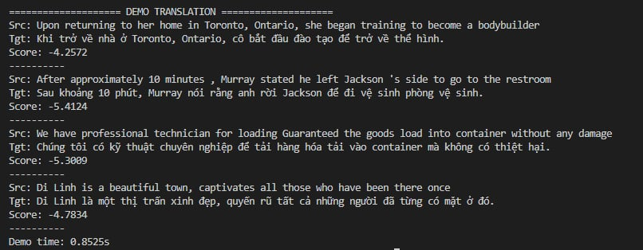

# Machine Translation
## Hệ thống dịch máy thần kinh Anh → Việt với Transformer
---

## Kết quả

- Đạt 0.725 điểm qua phương pháp đánh giá chất lượng mô hình dịch bằng model Comet, trên tập dữ liệu EVBCorpus 2.0
---

<p align="center">
  <strong>PyTorch 2.9</strong> · <strong>Transformer</strong> · <strong>Flash Attention</strong> · <strong>Beam Search</strong> · <strong>COMET</strong>
</p>

---

Dự án xây dựng **model dịch máy từ đầu** cho cặp ngôn ngữ **Anh → Việt**, sử dụng kiến trúc Transformer chuẩn kết hợp nhiều kỹ thuật tối ưu hiện đại. Tài liệu này liệt kê chi tiết **mọi công nghệ, kỹ thuật và thư viện đã sử dụng** trong quá trình phát triển.

---

## Mục lục

1. [Công nghệ & kỹ thuật đã sử dụng](#1-công-nghệ--kỹ-thuật-đã-sử-dụng)
2. [Kiến trúc Model](#2-kiến-trúc-model)
3. [Pipeline xử lý dữ liệu](#3-pipeline-xử-lý-dữ-liệu)
4. [Quy trình huấn luyện](#4-quy-trình-huấn-luyện)
5. [Suy luận & Inference](#5-suy-luận--inference)
6. [Cấu trúc dự án](#6-cấu-trúc-dự-án)
7. [Hướng dẫn cài đặt & chạy](#7-hướng-dẫn-cài-đặt--chạy)

---

# 1. Công nghệ & kỹ thuật đã sử dụng

## 1.1 Framework & thư viện chính

| Công nghệ | Phiên bản / Chi tiết | Cách sử dụng trong dự án |
|-----------|----------------------|---------------------------|
| **PyTorch** | 2.9.1 + CUDA 12.8 | Backend chính, `torch.nn`, `torch.amp` |
| **Transformers** | 4.57.3 | `LlamaTokenizerFast` cho SentencePiece |
| **Datasets (Hugging Face)** | 4.4.2 | Load CSV/TSV, `load_dataset`, `map` preprocess |
| **SentencePiece** | 0.2.1 | Tokenizer Unigram 40K subwords |
| **Unbabel COMET** | 2.2.7 | Đánh giá chất lượng dịch (`wmt22-comet-da`) |
| **SacreBLEU** | 2.5.1 | Metric BLEU |
| **TensorBoard** | 2.20.0 | Log loss, gradient, weight, learning rate |
| **NumPy / Pandas** | 1.26 / 2.3 | Xử lý dữ liệu, padding |
| **tqdm** | 4.67.1 | Progress bar training/inference |

---

## 1.2 Kiến trúc & kỹ thuật trong Model

### **Transformer – Encoder-Decoder**

- **6 layer Encoder** + **6 layer Decoder**
- **Self-attention** (encoder) không causal
- **Self-attention** (decoder) causal
- **Cross-attention** (decoder → encoder output)

### **PreNorm (Pre-Layer Normalization)**

- Dùng **RMSNorm** thay vì LayerNorm
- Thứ tự: `Norm → Attention/FFN → Add residual`
- File: `encoderblock.py`, `decoderblock.py`

### **GELU Activation**

- Activation trong FFN: **GELU** (Gaussian Error Linear Unit)
- File: `feedForwardNetword.py` – `FeedForwardNetwork_standard`

### **Embedding & Weight tying**

- **Token embedding** + **Position embedding** (learnable)
- Scale: `embed * √d_model`
- **Weight tying**: trọng số output projection = trọng số token embedding
- File: `embedding.py`, `model.py`

### **Khởi tạo trọng số**

- `nn.init.normal_(mean=0, std=0.02)` cho Q/K/V projection, FFN
- `nn.init.constant_(bias, 0)` cho bias
- File: `optimizerMultiheadAttention.py`, `feedForwardNetword.py`

---

## 1.3 Flash Attention & SDPA

### **OptimizedFlashMHA (Multi-Head Attention tối ưu)**

- Dùng `F.scaled_dot_product_attention` của PyTorch
- Kernel: `SDPBackend.EFFICIENT_ATTENTION`, `FLASH_ATTENTION`, `MATH`
- File: `optimizerMultiheadAttention.py` – `torch.nn.attention.sdpa_kernel`

```python
with torch.nn.attention.sdpa_kernel([SDPBackend.EFFICIENT_ATTENTION, SDPBackend.FLASH_ATTENTION, SDPBackend.MATH]):
    attn_output = F.scaled_dot_product_attention(q, k, v, attn_mask=attn_mask, dropout_p=...)
```

### **QKV fused projection**

- Một ma trận `in_proj_weight` (3×embed_dim × embed_dim) cho Q, K, V
- Giảm số lần gọi linear, tối ưu bộ nhớ

---

## 1.4 KV-Cache & inference autoregressive

### **KV-Cache trong Decoder**

- Lưu Key, Value của **self-attention** và **cross-attention** từ các bước trước
- Khi `use_cache=True`, mỗi bước chỉ tính cho **1 token mới**
- Tránh tính lại toàn bộ sequence → tăng tốc inference

### **Reorder cache trong Beam Search**

- Sau mỗi bước beam search, các beam được sắp xếp lại theo điểm
- `reorder_cache(beam_indices)` dùng `index_select` để reorder K, V theo thứ tự beam mới
- File: `decoderblock.py` – `reorder_cache()`, `beamsearch.py`

---

## 1.5 Beam Search

### **BeamSearchOptim**

- **Beam width**: 5 (configurable)
- **Length penalty**: `(5 + len)^α / 6^α` với `α = 0.6`
- **Per-beam top-k**: `min(vocab_size, beam_width × 4)` để giới hạn candidates
- **EOS handling**: finished beams không mở rộng thêm, score EOS = 0
- **Batch inference**: xử lý nhiều câu song song

### **Tích hợp KV-Cache**

- `use_cache=True`: chỉ forward 1 token mới mỗi bước, dùng cache cho các token trước
- `use_cache=False`: forward toàn bộ sequence mỗi bước (chậm hơn)

---

## 1.6 Dynamic padding & Teacher forcing

### **Dynamic padding**

- Mỗi batch padding theo **max length trong batch**, không cố định max_len
- `collate_fn` trong `dataloader2025.py` tính `max_length_src`, `max_length_tgt` theo batch

### **Key padding mask**

- Mask vị trí padding để attention không tính vào padding token
- Format: `True` = valid, `False` = pad

### **Teacher forcing**

- Training: decoder nhận **ground truth** (shift right) thay vì output model
- Target: `vi_ids_tgt = roll(vi_ids_src, -1)` với token cuối = PAD

---

## 1.7 Optimizer & Scheduler

### **AdamW**

- Learning rate: `5e-4`
- Betas: `(0.9, 0.98)`
- Eps: `1e-6`
- Weight decay: `0.01`

### **Cosine schedule với warmup**

- `create_cosine_schedule_with_warmup` trong `trainer.py`
- **Warmup**: `RATIO_WARMUP = 0.05` (5% tổng step)
- **Min LR ratio**: `RATIO_DECAY = 0.2` (LR cuối = 20% LR max)
- **Cycles**: 0.5 (nửa chu kỳ cosine)

### **Các scheduler khác (có trong code)**

- `WarmupLinearDecay`: warmup tuyến tính + decay tuyến tính
- `get_noam_scheduler_warmup`: Noam scheduler (Transformer paper)

---

## 1.8 Gradient accumulation & clipping

- **Accumulation steps**: 8 – cộng gradient 8 batch rồi mới update
- **Max gradient norm**: 1.0 – `nn.utils.clip_grad_norm_`
- **GradScaler**: dùng cho AMP (hiện `enabled=False` trong config)

---

## 1.9 Loss & Regularization

### **CrossEntropyLoss**

- `ignore_index = PADDING_TOKEN` – bỏ qua padding khi tính loss
- **Label smoothing**: `SMOOTHING = 0.1`

---

## 1.10 Dropout & Layer-specific

- **Encoder dropout**: `[0.1, 0.101, 0.102, 0.103, 0.104, 0.105]` – tăng dần theo layer
- **Decoder dropout**: tương tự
- **Embedding dropout**: 0.0

---

## 1.12 Bias trong Attention

- **encoder_bias**: `[False] × 6`
- **decoder_bias**: `[False] × 6`
- **output_projection_bias**: False

---

## 1.13 TensorBoard logging

| Metric | Mô tả | Hàm |
|--------|-------|-----|
| Loss/Train, Loss/Validation | Cross-entropy | `logLoss` |
| Gradients/{name} | Histogram gradient từng layer | `logGradient_histogram_mean_std` |
| Gradients_RMSNorm/{name} | Chuẩn hóa gradient | idem |
| Weights_Bias/{name} | Histogram weight | `logWeightBias_histogram_mean_std` |
| WeightsBias_STD, WeightsBias_RMSNorm | Thống kê weight | idem |
| Health/Dead_Weights_Ratio | Tỷ lệ weight ≈ 0 | `log_health_metrics` |
| Health/Update_Ratio | gnorm / wnorm | idem |
| Optimizer/LR | Learning rate | `logLearningRate` |

---

## 1.14 Checkpoint & resume

- Lưu: `model`, `optimizer`, `scheduler`, `scaler`, `step`, `epoch`
- Resume: load đủ state và tiếp tục từ `last_step`, `last_epoch`
- File: `train_model/util.py`

---

## 1.15 COMET evaluation

- Model: **Unbabel/wmt22-comet-da**
- Input: `{"src": en_text, "mt": translated, "ref": vi_text}`
- Gọi qua `comet_model.predict()` – đánh giá chất lượng dịch
- File: `trainer.py` – `cometEvaluation`

---

# 2. Kiến trúc Model

## 2.1 Tham số (arversion1.py)

| Tham số | Giá trị | Ghi chú |
|---------|---------|---------|
| `numlayer_enc` | 6 | Số layer encoder |
| `numlayer_dec` | 6 | Số layer decoder |
| `d_model` | 640 | Kích thước embedding |
| `d_ff` | 2560 | Hidden size FFN (4× d_model) |
| `num_of_heads` | 8 | Số head attention |
| `max_len` | 512 | Độ dài tối đa sequence |
| `vocab_size` | 40000 | Kích thước từ điển |

## 2.2 Cấu trúc luồng dữ liệu

```
Input (src, tgt)
    ↓
Embedding (token + position) × scale
    ↓
Encoder: [PreNorm → Self-Attn → Add] → [PreNorm → FFN → Add] × 6
    ↓
Decoder: [PreNorm → Self-Attn (causal) → Add] → [PreNorm → Cross-Attn → Add] → [PreNorm → FFN → Add] × 6
    ↓
Output projection (weight tying)
    ↓
Logits → Softmax (bên ngoài)
```

## 2.3 Đặc điểm kỹ thuật

- **RMSNorm** thay LayerNorm
- **GELU** trong FFN
- **Không dùng bias** ở encoder/decoder MHA và output projection
- **Weight tying** giữa embedding và output layer
- **Flash Attention** qua SDPA kernel của PyTorch
- **KV-cache** trong decoder khi inference

---

# 3. Pipeline xử lý dữ liệu

## 3.1 Nguồn dữ liệu

- **CCMatrix, OpenSubtitles, MultiHPLT, CCAligned, ParaCrawl** (OPUS)
- **PhoMT, VietAI** (Hugging Face)

## 3.2 Lọc cơ bản (filter_base.py – EnhancedBitextProcessor)

| Bước lọc | Mô tả |
|----------|-------|
| `alpha_ratio` | Tỷ lệ chữ cái/tổng ký tự ≥ 0.7 |
| `deescape_special_chars` | Chuẩn hóa HTML entities (&amp;, &lt;, …) |
| `normalize_whitespace` | Gộp nhiều khoảng trắng thành 1 |
| `remove_empty_line` | Xóa dòng trống |
| `currency_mismatch` | Loại cặp sai lệch đơn vị tiền tệ |
| `num_mismatch` | Loại cặp sai lệch số |
| `remove_control_char` | Xóa ký tự điều khiển |
| `deduplicate` | Loại trùng (hash) |
| `url_mismatch` | Loại cặp sai URL |
| `email_mismatch` | Loại cặp sai email |

## 3.3 Lọc nâng cao

### **FastText (filter_fasttext.py)**

- Model: `lid.176.bin` (Language Identification)
- Lọc câu không đúng ngôn ngữ (en/vi)
- Confidence threshold: 0.5

### **LaBSE (filter_LaBSE.py)**

- Model: `sentence-transformers/LaBSE`
- Lọc cặp có độ tương đồng nghĩa thấp
- Threshold: > 0.8 (cosine similarity)
- Batch processing cho file lớn

## 3.4 Lọc độ dài & format

- **filter_length_lengthratio.py**: giới hạn độ dài, tỷ lệ độ dài src/tgt
- **filter_remove_tab.py**: xử lý tab trong text
- Độ dài câu: **5 ≤ số token ≤ 250**
- **Curriculum_training.py**: sắp xếp theo độ dài tăng dần

## 3.5 Validation scripts

- `validation_disk.py` – kiểm tra dung lượng
- `validation_format.py` – kiểm tra định dạng
- `validation_len.py` – kiểm tra độ dài
- `validation_n_row.py` – kiểm tra số dòng
- `validation_sample.py` – lấy mẫu
- `validation_sumToken.py` – thống kê token

## 3.6 Tokenizer

- **SentencePiece Unigram** – 40,000 subwords
- **LlamaTokenizerFast** (Transformers) – wrap SentencePiece
- Special tokens: `<unk>`, `<s>`, `</s>`, `<pad>`
- Encode: thêm BOS + text + EOS
- File: `unigram_40000.model`, `unigram_40000.vocab`

## 3.7 Thống kê dataset

- ~**35.6M** cặp câu
- ~**2.19B** token
- Định dạng: TSV 2 cột `en`, `vi`

---

# 4. Quy trình huấn luyện

## 4.1 Tham số (config.py)

| Tham số | Giá trị | Ý nghĩa |
|---------|---------|---------|
| BATCH_SIZE | 32 | Batch size |
| NUM_WORKERS | 4 | DataLoader workers |
| PIN_MEMORY | True | Pin memory khi load |
| PERSISTENT_WORKERS | True | Giữ workers giữa các epoch |
| PREFETCH_FATOR | 4 | Prefetch batches |
| SHUFFLE | False | Không shuffle |
| ACCUMULATION_STEPS | 8 | Gradient accumulation |
| LEARNING_RATE | 5e-4 | Learning rate |
| EPOCHS | 4 | Số epoch |
| SAVE_STEP | 100000 | Lưu checkpoint mỗi 100k step |
| LOGGING_STEP | 10000 | Log mỗi 10k step |
| MAX_GRAD_NORM | 1.0 | Gradient clipping |
| SMOOTHING | 0.1 | Label smoothing |
| SEED | 28 | Random seed |

## 4.2 Luồng training

1. Load dataset TSV qua `datasets.load_dataset`
2. Pre-tokenize với `map` (batched, đa process)
3. DataLoader với `collate_fn` – dynamic padding, tạo mask
4. Forward: `model(en_ids, vi_ids_src, en_mask, vi_mask)`
5. Loss: CrossEntropy với ignore_index, label smoothing
6. Backward + accumulation
7. Clip gradient, step optimizer, step scheduler
8. Log TensorBoard, save checkpoint định kỳ
9. Validation mỗi SAVE_STEP
10. COMET evaluation (khi dùng dataset COMET riêng)

## 4.3 Xử lý lỗi

- Kiểm tra `torch.isfinite(loss)` – nếu NaN/Inf thì log chi tiết batch và lưu `bad_batch_debug.pt`

---

# 5. Suy luận & Inference

## 5.1 MTInference class (inference/run.py)

- Load checkpoint, tokenizer, model, beam search
- `translate(sequences, use_cache=True)` → danh sách câu dịch + scores
- `_prepare_batch`: encode, padding, tạo key_padding_mask
- `run_demo`: in kết quả demo
- `run_benchmark`: so sánh thời gian có/không KV-cache

## 5.2 Tham số inference

- `BEAM_WIDTH`: 5
- `MAX_LEN_INFERENCE`: 512
- `use_cache`: True (mặc định) – dùng KV-cache

## 5.3 Beam search validation (trong beamsearch.py)

- Test shape consistency
- Test cache reorder
- Test numerical stability (NaN/Inf)
- Test output distribution

---

# 6. Cấu trúc dự án

```
Machine Translation version2/
├── config.py                    # Toàn bộ cấu hình
├── environment.yml              # Conda env
├── mha_graph.png                # Sơ đồ MHA
├── recap.txt                    # Tóm tắt kiến thức
│
├── source/
│   ├── architecture/
│   │   └── arversion1.py        # Tham số kiến trúc
│   │
│   ├── build_model/
│   │   ├── model.py             # Transformer2025
│   │   ├── embedding.py         # Token + Position embedding
│   │   ├── encoderblock.py      # Encoder block
│   │   ├── decoderblock.py      # Decoder block + KV-cache
│   │   ├── feedForwardNetword.py
│   │   └── optimizerMultiheadAttention.py  # Flash MHA
│   │
│   ├── dataloader/
│   │   ├── dataloader2025.py
│   │   └── handle_data/
│   │       ├── Curriculum_training.py
│   │       ├── filter_base.py, filter_fasttext.py, filter_LaBSE.py
│   │       ├── filter_length_lengthratio.py, filter_remove_tab.py
│   │       ├── validation_*.py
│   │       └── ZReadme.md
│   │
│   ├── tokenizer/
│   │   ├── tokenizer2025.py
│   │   ├── create_vocab.py
│   │   ├── unigram_40000.model
│   │   └── unigram_40000.vocab
│   │
│   ├── inference/
│   │   ├── run.py               # MTInference
│   │   └── beamsearch.py        # BeamSearchOptim
│   │
│   └── train_model/
│       ├── trainer.py           # Trainer2025
│       └── util.py              # Checkpoint, logging
│
└── Saved/                       # Checkpoints
```

---

# 7. Hướng dẫn cài đặt & chạy

## 7.1 Yêu cầu

- Python 3.10+
- CUDA (khuyến nghị cho training/inference)
- RAM ≥ 16GB, VRAM ≥ 8GB (batch 32)

## 7.2 Cài đặt

```bash
conda env create -f environment.yml
conda activate machinetranslation
```

Hoặc:

```bash
pip install torch transformers datasets sentencepiece unbabel-comet sacrebleu tensorboard tqdm numpy pandas
```

## 7.3 Cấu hình

Chỉnh `config.py`:

- `MODEL_SPM_PATH`, `TSV_TRAINING`, `TSV_VALIDATION`, `TSV_TEST`
- `LOAD_CHECKPOINT_PATH` (resume)
- `SAVE_PATH`, `ROOT_FOLDER_SAVE`

## 7.4 Training

```bash
python -m source.train_model.trainer
```

TensorBoard:

```bash
tensorboard --logdir=runs
```

## 7.5 Inference

```bash
python -m source.inference.run
```

Hoặc:

```python
from source.inference.run import MTInference, run_demo
translator = MTInference(checkpoint_path="Saved/checkpoint_xxx.pt")
run_demo(translator, ["Your English sentence here"])
translator.cleanup()
```

---

## Tài liệu tham khảo (recap.txt)

- Kiến trúc Transformer, self-attention
- Teacher forcing, GELU, RMSNorm
- Flash Attention, KV-cache, Fused kernel
- Beam search, length penalty
- Dynamic padding
- Scheduler (Warmup, Cosine, Noam)
- Adam/AdamW, Gradient accumulation
- GradScaler + AMP
- CrossEntropyLoss, label smoothing
- Định luật Chinchilla (chuẩn bị dữ liệu)